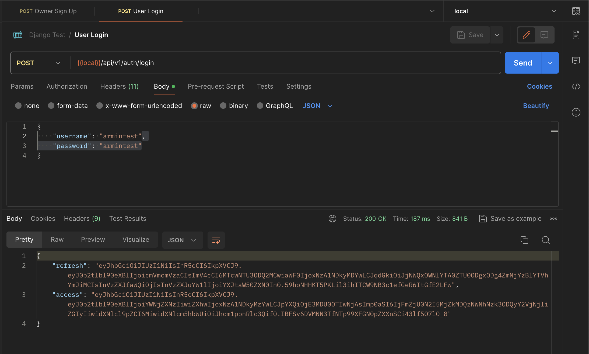
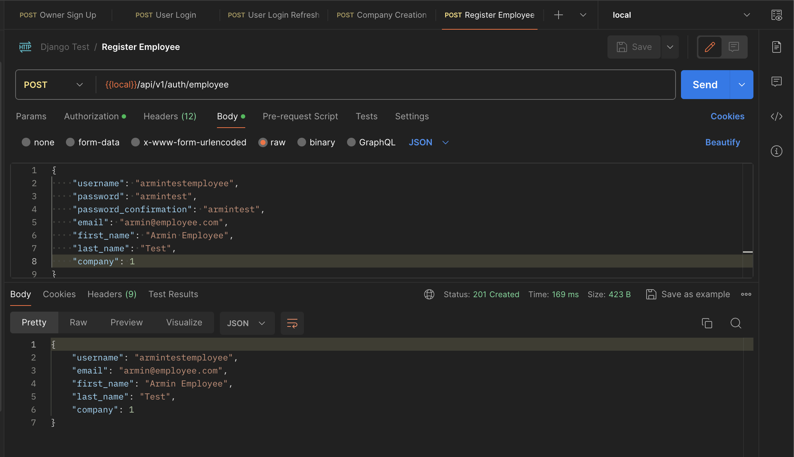

## Issues
1. Solve the circular dependency and migration issues
2. Create API for owner sign-up
    - 
3. Create API for user login
    - 
    - 
4. Create API for company creation (This API can be accessed after user login)
    - 
5. Create API for registered new employee (Only Owner of company has access to it)
    - 
6. Create django admin for User and Company models
    - 
7. Create django command to filled the Authentication and Authorization Group in the django admin that all staff can only add and view all models 
    - 
8. If employee created from django admin, add validation for the company must not be null
    - 
    - 
    - 
9.  Use OpenAPI schema based to showed all of the API endpoint
    - 
10. Use SQLlite3 as DB that already migrated with the models (put it in the project as POC)
